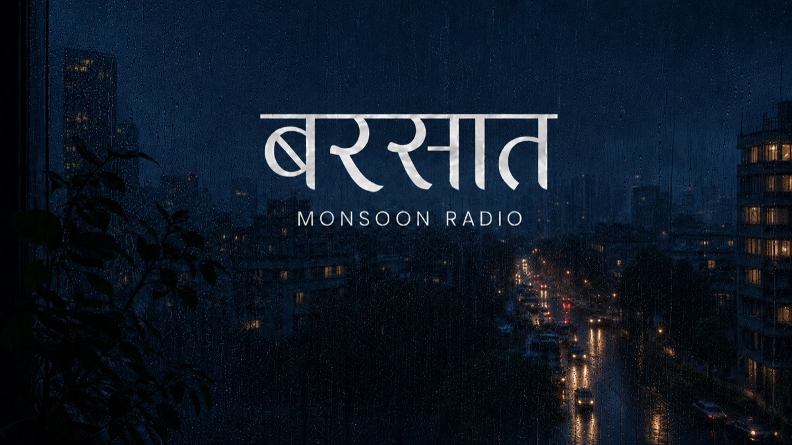

# बरसात — Monsoon Radio 🌧️

A cinematic monsoon music experience built around rain, nostalgia, Indian music, and quiet listening.

**Live:** [https://barsaat.in/](https://barsaat.in/)

## About

Barsaat is an atmospheric web-based music experience combining YouTube-powered playback with a cinematic rainy-city environment. Its interface is designed to feel like listening beside a rain-covered window: quiet, immersive, and gently removed from an ordinary music app.

## Live Website

[https://barsaat.in/](https://barsaat.in/)

## Preview



## Features

- Custom YouTube-powered music player with four playlist sources
- Play, pause, previous, next, seeking, and cross-playlist song shuffle
- Current track title, artist, thumbnail, and rotating album disc
- Responsive DAY and NIGHT scenes with cinematic crossfades
- Canvas rain with Drizzle, Rain, Heavy Rain, and Cloudburst intensities
- Independent music and rain ambience volume controls
- Optional distant thunder
- Liquid-glass controls and responsive mobile composition
- Live listener indicator with a resilient local preview fallback
- Media Session support and desktop keyboard controls
- Social sharing for the current track
- Dynamic song-level Open Graph metadata and 1200×630 share artwork
- Reduced-motion support, structured metadata, sitemap, and branded 404 page

## Tech Stack

- Semantic HTML
- Custom CSS
- Vanilla JavaScript
- Vite
- YouTube IFrame Player API
- Canvas API and native HTML Audio
- Media Session API where supported
- PHP 8 and GD for server-rendered track sharing metadata and images

## Getting Started

```bash
git clone https://github.com/dineshjngr/barsaat.in.git
cd barsaat.in
npm install
npm run dev
```

Vite serves the local project at `http://localhost:5173/` by default. If that port is occupied, it selects the next available port.

## Production Build

```bash
npm run lint
npm run build
```

The optimized production output is written to `dist/`.

## Music Playback

Barsaat uses the YouTube IFrame Player API as its playback engine while presenting a completely custom Monsoon Radio interface. Playback starts only after user interaction. Rain ambience is handled separately through native audio so music and weather can be mixed independently.

## Design

The visual system combines rain-covered Indian city scenes, a responsive day/night experience, translucent liquid-glass controls, restrained motion, and Canvas-rendered rain. The desktop composition stays spacious while mobile uses a deliberately reorganized player and control layout.

## Deployment

The production site is available at [https://barsaat.in/](https://barsaat.in/).

Track-specific metadata routes in `public/listen/` require PHP 8+, GD, Apache-compatible rewrite rules, and either cURL or outbound HTTPS streams. If GD is unavailable, share images fall back to `public/social-card.jpg`.

## Public Assets

- Backgrounds: `public/backgrounds/`
- Original background sources: `source-assets/backgrounds/`
- Cover fallback: `public/covers/monsoon-fallback.svg`
- Homepage social image: `public/social-card.jpg`
- Dynamic share-card template: `public/listen/og.php`
- Server and crawler configuration: `public/.htaccess`, `public/robots.txt`, `public/sitemap.xml`

## License

All rights reserved.
